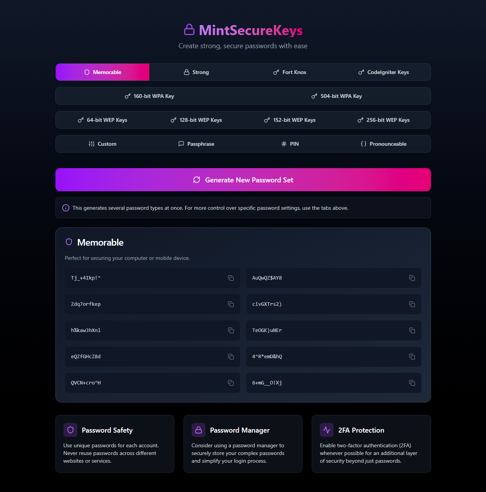

# MintSecureKeys



A modern, secure password and key generator built with SvelteKit.

## Features

- **Multiple Password Types**:
    - Custom complex passwords with adjustable settings
    - Easy-to-remember passphrases
    - Numeric PINs of various lengths
    - Pronounceable passwords that balance security and memorability
    - Random passwords for various security levels

- **User-Friendly Interface**:
    - Clean, modern design with dark theme
    - Copy passwords to clipboard with a single click
    - Visual strength indicators
    - Intuitive controls for customizing passwords

- **Security First**:
    - All generation happens locally in the browser
    - No passwords are stored or transmitted over the network
    - Uses cryptographically secure random number generators

## Getting Started

### Prerequisites

- Node.js (v16 or higher)
- npm or yarn

### Installation

1. Clone the repository:
   ```bash
   git clone https://github.com/seracoder/mintsecurekeys.git
   cd mintsecurekeys
   ```

2. Install dependencies:
   ```bash
   npm install
   # or
   yarn
   ```

3. Run the development server:
   ```bash
   npm run dev
   # or
   yarn dev
   ```

4. Open your browser and navigate to `http://localhost:5173/`

### Building for Production

```bash
npm run build
# or
yarn build
```

## Tech Stack

- [SvelteKit](https://kit.svelte.dev/) - Front-end framework
- [TypeScript](https://www.typescriptlang.org/) - Type safety
- [Tailwind CSS](https://tailwindcss.com/) - Styling
- [Lucide Icons](https://lucide.dev/) - Icon pack
- [Flowbite Svelte](https://flowbite-svelte.com/) - UI component library

## Project Structure

```
/
├── src/
│   ├── lib/
│   │   ├── components/           # UI components
│   │   │   ├── custom-generators/ # Password generator components
│   │   │   └── ...
│   │   ├── generators/           # Password generation logic
│   │   └── categories/           # Password category definitions
│   ├── routes/                   # SvelteKit routes
│   └── app.html                  # HTML template
└── static/                       # Static assets
```

## Password Generation Types

### Custom Password

Generate passwords with specific character requirements:
- Include/exclude uppercase letters
- Include/exclude lowercase letters
- Include/exclude numbers
- Include/exclude special characters
- Adjust password length

### Passphrase

Generate memorable passphrases made of random words:
- Adjust number of words
- Easy to remember, hard to crack

### PIN Generator

Generate numeric PINs:
- Choose length (4, 6, 8, or 10 digits)
- Perfect for device passcodes and financial applications

### Pronounceable Password

Generate pronounceable passwords:
- Easier to remember than completely random passwords
- Still maintains strong security
- Adjust length as needed

### Preset Password Types

Quick access to various preset password types:
- Memorable passwords
- Strong passwords
- Maximum strength passwords
- Numeric passwords
- PIN codes
- Special character passwords

## Security Considerations

- This tool is designed for client-side password generation only
- We recommend using a secure password manager to store your generated passwords
- Always enable two-factor authentication when available
- Use unique passwords for each service or website

## Contributing

Contributions are welcome! Please feel free to submit a Pull Request.

1. Fork the project
2. Create your feature branch (`git checkout -b feature/amazing-feature`)
3. Commit your changes (`git commit -m 'Add some amazing feature'`)
4. Push to the branch (`git push origin feature/amazing-feature`)
5. Open a Pull Request

## License

This project is licensed under the MIT License - see the LICENSE file for details.
